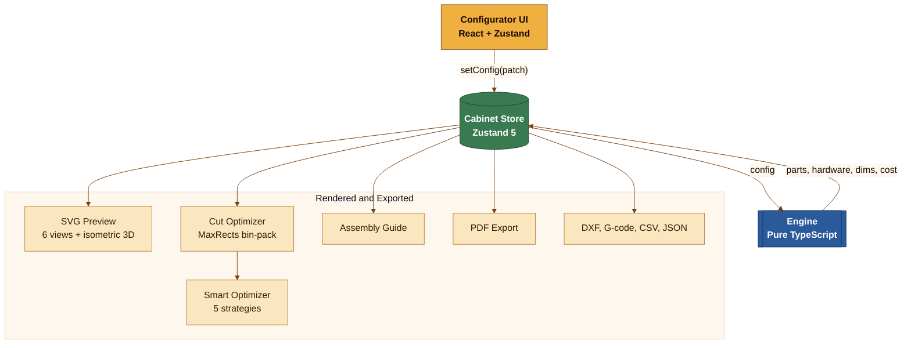

# Tiferet Carpentry — מתכנן דירה ונגרות

<div align="center">
  
</div>

<div align="center">

[](https://github.com/huxhkuh/tiferet-carpentry/actions/workflows/ci.yml)
[](https://github.com/huxhkuh/tiferet-carpentry/actions/workflows/pages.yml)
[](https://github.com/huxhkuh/tiferet-carpentry/actions/workflows/cloudflare-pages.yml)
[](https://github.com/huxhkuh/tiferet-carpentry/actions/workflows/codeql.yml)
[](https://codecov.io/gh/huxhkuh/tiferet-carpentry)
[](LICENSE)
[](tsconfig.json)
[](package.json)
[](vite.config.ts)
[](src/index.css)
[](public/manifest.json)
[](src/i18n)
[](tests/)
[](config/bundle-budget.json)
[](tests/e2e)
[](https://github.com/huxhkuh/tiferet-carpentry/commits/main)
[](https://github.com/huxhkuh/tiferet-carpentry/stargazers)

**[🚀 אתר חי](https://huxhkuh.github.io/tiferet-carpentry/)** · **[📋 Changelog](CHANGELOG.md)** · **[🗺 Roadmap](ROADMAP.md)** · **[🏛 Architecture](docs/ARCHITECTURE.md)** · **[📖 User Guide](docs/USER-GUIDE.md)** · **[📚 Docs](docs/index.md)**

</div>

---

> **Tiferet Carpentry** הוא מתכנן דירה ונגרות עברי לפרויקט תפארת ברמלה. הוא מאפשר
> לבחור את דירה 5-1, לעבור בין חדרים, להציב ריהוט וארונות על קירות מדויקים, לערוך
> אותם בתצוגות דו־ממד ותלת־ממד ולשמור את התכנון מקומית. מנוע הנגרות מבוסס על
> [WoodworkingShop](https://github.com/RajwanYair/WoodworkingShop) בקוד פתוח; פרטי
> הרישוי והייחוס נמצאים ב־[THIRD_PARTY_NOTICES.md](THIRD_PARTY_NOTICES.md).

<div align="center">
  
</div>

---

## ✨ Features

### 🎛 Configurator

| Feature               | Details                                                                                     |
| --------------------- | ------------------------------------------------------------------------------------------- |
| **Quick Presets**     | 6 one-click templates: kitchen base/wall, tall pantry, bookcase, wardrobe, bathroom vanity  |
| **Furniture types**   | Cabinet · Bookshelf · Desk · Wardrobe — each with type-specific part generation             |
| **Dimensions**        | Width / height / depth sliders with free-text numeric entry; metric mm or fractional inches |
| **Toe kick / plinth** | Configurable kick height (0 = flush-to-floor or wall-mounted)                               |
| **Shelves**           | Count, equal or custom spacing, drag-to-reposition in the preview                           |
| **Doors**             | Flat · Shaker · Glass · None; 1 or 2 doors; configurable reveal                             |
| **Drawers**           | 0–6 drawers with individual per-drawer box height                                           |
| **Materials**         | Built-in library (plywood, melamine, MDF, chipboard, glass) + custom material editor        |
| **Grain direction**   | Mark materials as grain-sensitive — cut optimizer never rotates those parts 90°             |
| **Edge banding**      | All-visible · Doors-only · None                                                             |
| **Handles**           | Bar · Knob · Cup pull · None                                                                |
| **Save / Load**       | localStorage presets + download/upload JSON config files                                    |
| **Shareable URLs**    | Full config encoded in URL query params; one-click copy                                     |

### 🖼 Preview

| Feature                   | Details                                                          |
| ------------------------- | ---------------------------------------------------------------- |
| **6 views**               | Front (closed) · Front (open) · Side · Top · Back · Isometric 3D |
| **Dimension annotations** | Arrowhead dim lines; unit-aware labels (mm or fractional in)     |
| **Grain arrows**          | Per-part grain direction overlaid on cut sheets                  |
| **SVG + PNG export**      | Download any view as a vector SVG or 2× rasterised PNG           |
| **Pinch / swipe**         | Touch zoom and swipe-between-views on mobile                     |
| **Dark mode**             | Full dark theme; SVG dim lines use `currentColor`                |

### 📐 Cut-Sheet Optimizer

| Feature                  | Details                                                                           |
| ------------------------ | --------------------------------------------------------------------------------- |
| **MaxRects bin-packing** | State-of-the-art 2D bin-packing across standard 2440×1220 mm sheets               |
| **Grain constraints**    | Grain-sensitive materials skip 90° rotation during placement                      |
| **Smart optimizer**      | 5 strategies: reduce depth · co-nest strips · adjust width/height · material swap |
| **Comparison view**      | Side-by-side original vs optimised config with waste diff                         |
| **Interactive sheets**   | Hover to highlight parts; waste hatch patterns; edge-banding and grain indicators |
| **Color-blind safe**     | Wong palette toggle (deuteranopia-friendly)                                       |
| **Multi-cabinet**        | Combine all cabinets in a project into one optimised cut run                      |

### 📤 Export

| Format        | Details                                                                                       |
| ------------- | --------------------------------------------------------------------------------------------- |
| **PDF**       | Cover · specs · parts table · hardware BOM · cut diagrams · assembly sequence · shopping list |
| **DXF**       | AutoCAD R12 DXF for CNC routers; per-sheet or combined                                        |
| **G-code**    | CNC router toolpath export                                                                    |
| **CSV BOM**   | Bill of materials as spreadsheet-ready CSV                                                    |
| **SVG / PNG** | Preview panels as vector or raster image                                                      |
| **JSON**      | Full config export/import                                                                     |

### 🛠 Other

- 🏗 **Assembly guide** — numbered steps with progress bar, part highlighting, and pro tips
- 💰 **Cost estimator** — per-material sheet costs + hardware + edge banding; live sidebar total
- ↩ **Undo / Redo** — full change history (`Ctrl+Z` / `Ctrl+Y`)
- ⌨ **Keyboard shortcuts** — `Alt+1-5` tabs, `Ctrl+Z/Y`, `Ctrl+P`, `?` for help modal
- 📱 **PWA / Offline** — service worker; installable as a desktop or mobile app
- 🌐 **Multilingual** — 6 languages: EN, HE, AR, DE, ES, FR (with full RTL support)
- ♿ **Accessible** — ARIA landmarks, keyboard nav, skip-to-content, screen-reader labels
- 🖨 **Print-friendly** — `@media print` hides UI chrome; optimises tables and SVGs for paper

---

## 🚀 Quick Start

```bash
# 1 — clone
git clone https://github.com/huxhkuh/tiferet-carpentry.git
cd tiferet-carpentry

# 2 — install (deterministic, uses package-lock.json)
npm ci

# 3 — dev server  →  http://localhost:5173/tiferet-carpentry/
npm run dev

# 4 — run 950+ unit tests
npm test

# 5 — production build  →  dist/
npm run build
```

> **Node.js >= 22** is required.

---

## פריסה אוטומטית ב־GitHub Pages

כל `push` לענף `main` מפעיל את [תהליך הפריסה](.github/workflows/pages.yml):
היישום נבנה, תיקיית `dist` נשלחת ל־GitHub Pages והאתר מתעדכן בכתובת
<https://huxhkuh.github.io/tiferet-carpentry/>. אפשר להפעיל את אותה פריסה ידנית גם
מהלשונית **Actions** באמצעות `Run workflow`. מקור הפריסה בהגדרות Pages צריך להיות
**GitHub Actions**; אין צורך בשרת, בחשבון בתשלום או בסודות נוספים.

---

## 🏗 Tech Stack

<div align="center">
  
</div>

| Layer         | Technology                                                 |
| ------------- | ---------------------------------------------------------- |
| Framework     | ⚛️ React 19                                                |
| Language      | 🔷 TypeScript 6 (strict mode)                              |
| Styling       | 🎨 Tailwind CSS 4                                          |
| State         | 🐻 Zustand 5                                               |
| PDF           | 📄 @react-pdf/renderer 4                                   |
| i18n          | 🌐 i18next 26 + react-i18next                              |
| Build         | ⚡ Vite 8                                                  |
| Unit tests    | 🧪 Vitest 4 + @testing-library/react                       |
| E2E tests     | 🎭 Playwright                                              |
| Lint / format | 🧹 ESLint 10 (flat config) + Prettier                      |
| CI/CD         | 🤖 GitHub Actions                                          |
| Deploy        | 🚀 GitHub Pages + Cloudflare Pages (edge CDN, PR previews) |

---

## 🏛 Architecture

All computation runs **client-side** — no backend, no account required.



**Engine modules** (`src/engine/`) are pure TypeScript with no React dependencies — fully testable without a DOM.

```text
src/
├── engine/          # Pure TS — types, materials, dimensions, parts, hardware,
│                    #   cut-optimizer, smart-optimizer, assembly, cost-estimator
├── components/      # React UI — configurator, preview, optimizer, assembly, pdf, layout
├── store/           # Zustand — cabinet-store, custom-materials-store, toast-store
├── hooks/           # useTouchGestures
├── i18n/            # en.json · he.json · setup
└── utils/           # bom-export · dxf-export · gcode-export · url-state · units · download
```

→ Full architecture docs: [docs/ARCHITECTURE.md](docs/ARCHITECTURE.md)

---

## 🔧 Development Commands

```bash
npm run typecheck       # TypeScript strict-mode check (tsc --noEmit)
npm run lint            # ESLint — 0 warnings policy
npm run format          # Prettier auto-format
npm run format:check    # Verify formatting (used in CI)
npm run i18n:coverage   # Check EN ↔ HE translation parity
npm run bundle:check    # Bundle budget and size guard
npm run bench:check     # Engine benchmark regression gate (5× baseline thresholds)
npm run check           # typecheck + lint + format:check + test  (pre-commit gate)
npm run ci              # check + build + bundle:check  (full CI pipeline)
npm run test:e2e        # Playwright end-to-end tests
```

## 🧰 Tooling and Intermediate Files

- Shared development tooling baseline is maintained one level up under `MyScripts/.tools`.
- Project scripts remain the source of truth for this repository's behavior.
- Intermediate artifacts and cache outputs are routed to OS TEMP paths (for example `%TEMP%/WoodworkingShop`) rather than committed workspace folders.
- Generated outputs such as `dist`, `coverage`, `test-results`, and Playwright HTML reports are treated as disposable artifacts, not source-of-truth content.

---

## 🌐 Internationalization

The app ships with **6 languages**: English, Hebrew (RTL), Arabic (RTL),
German, Spanish, and French.
All UI strings live in `src/i18n/{en,he,ar,de,es,fr}.json`.
Run `npm run i18n:coverage` to verify all locale files are in sync.

---

## ⚡ Performance Benchmarks

Measured on a mid-range development machine (Intel i7 / 16 GB RAM, Chrome 125, production build).

| Metric                                       | Value     | Target   |
| -------------------------------------------- | --------- | -------- |
| Lighthouse Performance score                 | 97 / 100  | ≥ 90     |
| Lighthouse Accessibility score               | 100 / 100 | 100      |
| First Contentful Paint (FCP)                 | ~0.4 s    | < 1.0 s  |
| Largest Contentful Paint (LCP)               | ~0.7 s    | < 2.5 s  |
| Total Blocking Time (TBT)                    | 0 ms      | < 200 ms |
| Cumulative Layout Shift (CLS)                | 0.000     | < 0.1    |
| JS bundle — main entry (gzip)                | ~130 KB   | < 200 KB |
| JS bundle — PDF chunk (gzip, lazy-loaded)    | ~490 KB   | < 600 KB |
| Cut-optimizer (200-part project, web worker) | < 15 ms   | < 50 ms  |
| generateParts (default 2000 mm cabinet)      | < 0.3 ms  | < 1 ms   |
| BOM CSV generation (10 cabinets)             | < 2 ms    | < 10 ms  |
| Engine bench — generateParts (wardrobe)      | < 0.5 ms  | < 1 ms   |
| Engine bench — findOptimizations (12 parts)  | < 2 ms    | < 10 ms  |

> Benchmarks are measured against the production build (`npm run build`).
> Run `npm run preview` locally and open Chrome DevTools → Lighthouse to reproduce.
> Worker timing is reported in the browser console (debug build only).

---

## 🚢 Deployment

The app auto-deploys to **GitHub Pages** on every push to `main` via [`.github/workflows/pages.yml`](.github/workflows/pages.yml).

### Cloudflare Pages (Phase 12 / Sprint 15)

A parallel Cloudflare Pages deployment is configured via [`.github/workflows/cloudflare-pages.yml`](.github/workflows/cloudflare-pages.yml).
It provides edge CDN delivery at 250+ PoPs and automatic PR preview deployments.

**Setup** (one-time, in the GitHub repository settings under _Secrets and variables → Actions_):

| Secret / Variable         | Description                                                                                                                                  |
| ------------------------- | -------------------------------------------------------------------------------------------------------------------------------------------- |
| `CLOUDFLARE_API_TOKEN`    | CF API token with **Cloudflare Pages: Edit** permission                                                                                      |
| `CLOUDFLARE_ACCOUNT_ID`   | Found in the Cloudflare dashboard URL                                                                                                        |
| `VITE_CF_ANALYTICS_TOKEN` | _(Optional)_ Cloudflare Web Analytics beacon token — enables privacy-first page-view tracking (no cookies, no PII, no GDPR consent required) |

The `_redirects` file in `public/` handles SPA fallback routing (`/* → /index.html 200`)
so direct URL navigation and refreshes work correctly on Cloudflare Pages.

For a tagged release:

```bash
# 1 — bump version
npm version patch   # or minor / major

# 2 — update CHANGELOG.md, push
git push --follow-tags

# 3 — create GitHub Release (CI builds and attaches artifacts)
gh release create vX.Y.Z --generate-notes
```

---

## ❓ Troubleshooting

| Issue                | Solution                                                                        |
| -------------------- | ------------------------------------------------------------------------------- |
| `npm ci` fails       | Ensure **Node.js >= 22**. Delete `node_modules` and retry                       |
| TypeScript errors    | Run `npm run typecheck` for details. Strict mode is on                          |
| Lint failures        | Run `npm run lint` — 0 warnings policy; fix root causes                         |
| Chunk size warning   | Expected for `@react-pdf/renderer` (~1.5 MB) — it is code-split and lazy-loaded |
| Tests fail           | Run `npm test` — requires jsdom. Check `vitest.config.ts`                       |
| Hebrew layout broken | Ensure `<html dir="rtl">` is set when language is `he`                          |

---

## 🤝 Contributing

Contributions are welcome! Please read [`.github/CONTRIBUTING.md`](.github/CONTRIBUTING.md) first.

Quick checklist before opening a PR:

1. `npm run check` passes (typecheck + lint + format + tests)
2. `npm run build` succeeds with 0 warnings
3. New features include unit tests
4. i18n keys added to **all 6 locale files** (en + he proper, ar/de/es/fr at minimum)

---

## 🔍 GitHub Topics & Discoverability

<!-- GitHub repository topics (set via Settings → Topics):
     woodworking  cabinet-design  cut-optimizer  furniture-planner  woodworking-tools
     cabinet-maker  bin-packing  maxrects  pdf-export  dxf-export  gcode  bom
     react  typescript  vite  tailwindcss  zustand  pwa  offline-app  web-app
     multilingual  hebrew  rtl  arabic  open-source  mit-license  browser-based  no-backend
     cnc  nesting  sheet-goods  parametric-design  furniture-design  cut-list
-->

**Keywords:** cabinet planner, woodworking design tool, cut list optimizer,
furniture layout planner, sheet goods optimizer, MaxRects bin packing algorithm,
CNC export DXF G-code, cabinet maker software free, free woodworking app,
browser-based cabinet design, parametric furniture designer,
multilingual RTL Hebrew Arabic, PWA offline woodworking,
React TypeScript woodworking app, cut sheet optimizer free online,
cabinet layout generator, kitchen cabinet planner, wardrobe designer,
bookcase builder, furniture cut list software, nesting software free,
panel optimization, 2D bin packing, wood cutting calculator,
material waste reduction, edge banding calculator, hardware BOM generator,
assembly instructions generator, woodworking project planner

### Why Cabinet Planner?

| Need                        | Solution                                                  |
| --------------------------- | --------------------------------------------------------- |
| **Design cabinets quickly** | Parametric configurator with live 6-view preview          |
| **Minimize material waste** | MaxRects bin-packing optimizer reduces sheet waste to <5% |
| **Export for CNC machines** | DXF and G-code output for router/laser cutters            |
| **Generate cut lists**      | Automatic BOM with CSV/PDF export                         |
| **Work offline**            | PWA — install on any device, no internet needed           |
| **Multi-language**          | EN, HE, AR (RTL), DE, ES, FR                              |
| **Free forever**            | MIT license, no account, no backend, no tracking          |

---

## �📄 License

[MIT](LICENSE) © RajwanYair
