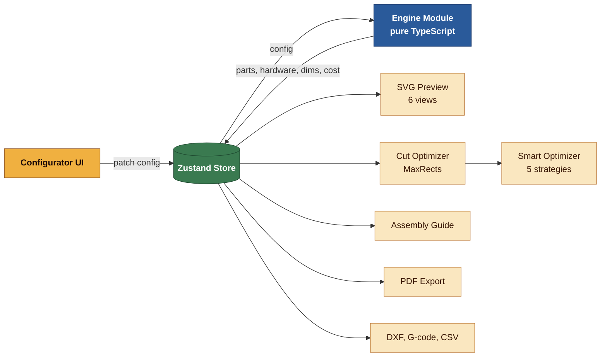
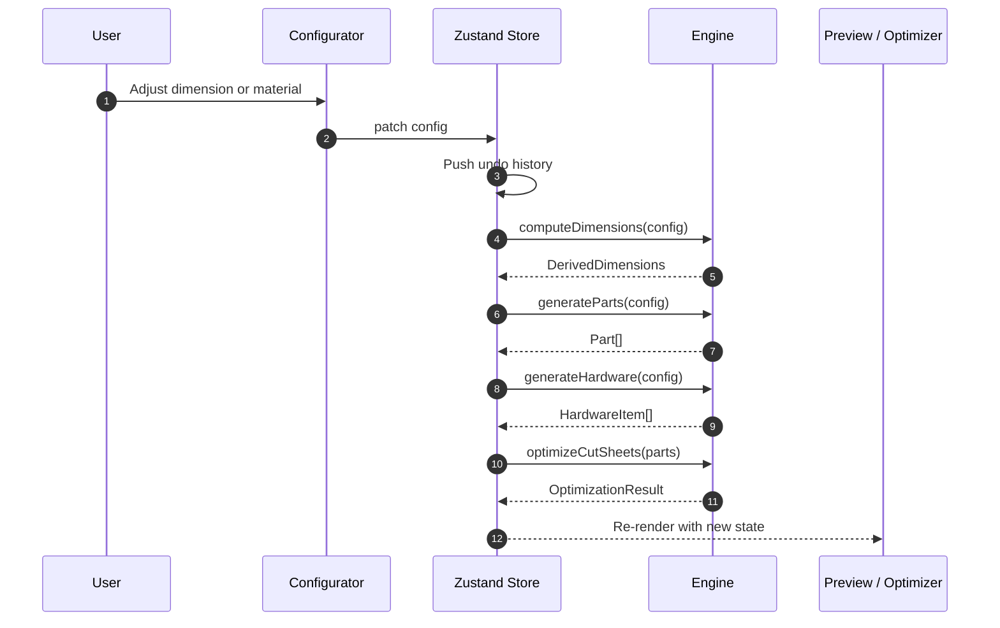
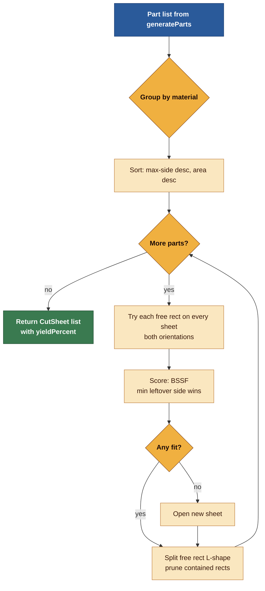
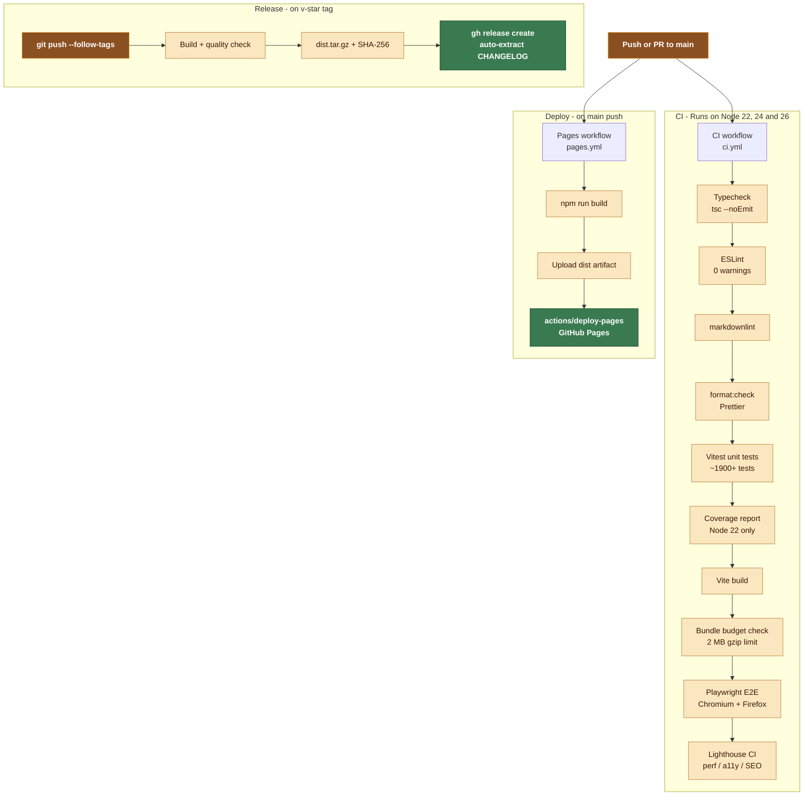
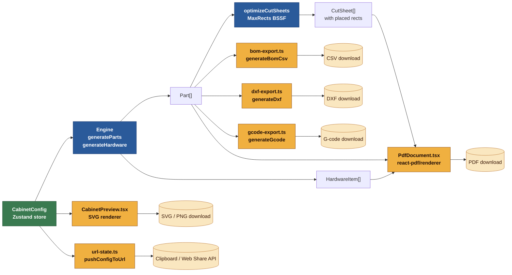
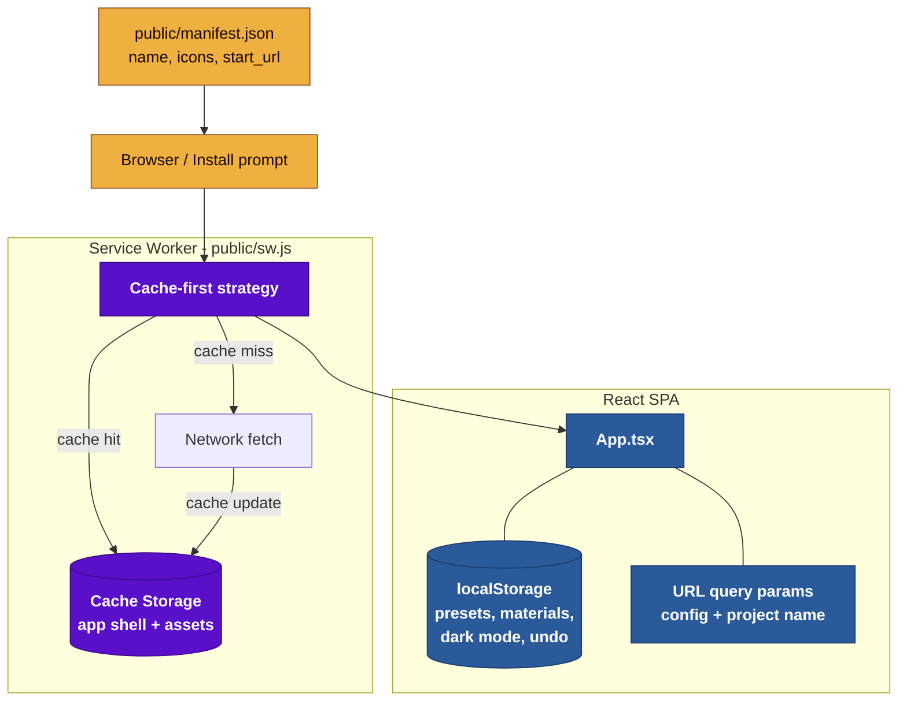
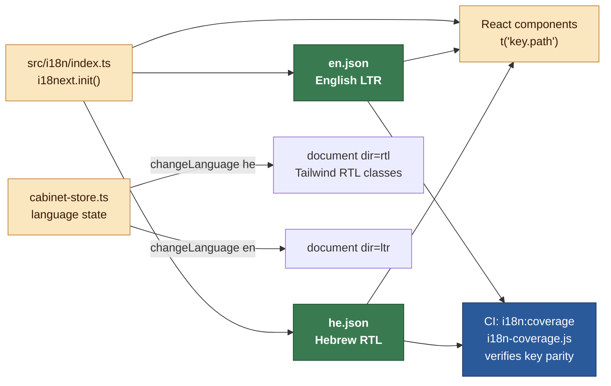

# 🏛 Architecture

<div align="center">
  
</div>

Cabinet Planner is a client-side React SPA (no backend). All computation — dimensions, parts, hardware, cut-sheet optimization, cost estimation — runs in the browser.

> **Module reference** — For competitive positioning, product strategy, and sprint planning see [ROADMAP.md](../ROADMAP.md). For user-facing feature descriptions see [USER-GUIDE.md](USER-GUIDE.md).

## ⚡ High-Level Data Flow



## 📁 Directory Layout

```text
src/
├── main.tsx                 # React 19 entry point
├── App.tsx                  # Root component: tabs, keyboard shortcuts, layout
├── index.css                # Tailwind theme, print styles, RTL support
├── engine/                  # Pure TypeScript computation (no React)
│   ├── types.ts             # Domain types: CabinetConfig, Part, HardwareItem, etc.
│   ├── materials.ts         # Material database, constraints, defaults
│   ├── dimensions.ts        # Derived dimensions from config
│   ├── parts.ts             # Part list generation
│   ├── hardware.ts          # Hardware BOM generation
│   ├── cut-optimizer.ts     # FFD bin-packing for cut sheets
│   ├── smart-optimizer.ts   # 5 optimization strategies
│   ├── assembly.ts          # Assembly step generation
│   ├── cost-estimator.ts    # Cost breakdown calculation
│   └── index.ts             # Barrel exports
├── components/
│   ├── configurator/        # Config panel: sliders, selectors, material editor
│   ├── preview/             # SVG cabinet views (6 views + isometric 3D)
│   ├── optimizer/           # Cut sheet visualization, smart optimizer, comparison
│   ├── assembly/            # Step-by-step assembly guide
│   ├── pdf/
│   │   ├── CabinetPdfDocument.tsx  # Thin orchestrator (imports sections/)
│   │   ├── pdf-tokens.ts    # Font.register, StyleSheet, design tokens
│   │   ├── pdf-i18n.ts      # EN+HE dictionary for PDF rendering
│   │   ├── pdf-helpers.ts   # Pure helpers (assemblyStepsI18n, sheetSummary)
│   │   ├── PdfExportPanel.tsx
│   │   └── sections/        # 15 focused page/section components
│   └── layout/              # Header, sidebar, toast, onboarding overlay
├── store/
│   ├── cabinet-store.ts     # Main Zustand store: config, derived state, undo/redo
│   ├── custom-materials-store.ts  # User-defined materials
│   ├── room-store.ts        # Room layout state
│   └── toast-store.ts       # Notification queue
├── hooks/
│   ├── useFocusTrap.ts      # Accessible modal focus management
│   ├── useIntersectionVisible.ts
│   └── usePwaFileHandlers.ts
├── i18n/
│   ├── index.ts             # i18next setup
│   ├── en.json              # English translations
│   └── he.json              # Hebrew translations (RTL)
├── utils/
│   ├── bom-export.ts        # CSV bill of materials export
│   ├── download.ts          # Shared file download helper
│   ├── dxf-export.ts        # AutoCAD R12 DXF export for CNC
│   ├── gcode-export.ts      # G-code export for CNC routers
│   ├── local-storage.ts     # localStorage persistence
│   ├── units.ts             # Metric ↔ imperial conversion
│   └── url-state.ts         # URL query param serialization
└── assets/                  # Static assets (favicon, etc.)

public/
├── manifest.json            # PWA manifest
├── sw.js                    # Service worker (cache-first)
├── robots.txt               # Search engine directives
├── sitemap.xml              # Sitemap
└── 404.html                 # GitHub Pages SPA fallback

tests/                       # Vitest unit tests (mirrors src/ structure)
  ├── helpers.ts             # Shared test fixtures (cfg, mockSheet, mockPart)
  ├── assertions.ts          # Reusable test assertions (bilingual, sequential)
.github/
├── workflows/
│   ├── ci.yml               # CI: typecheck → lint → test → build
│   ├── release.yml          # Release: build + GitHub Release with artifacts
│   └── pages.yml            # Deploy to GitHub Pages on push to main
├── ISSUE_TEMPLATE/          # Bug report, feature request
├── PULL_REQUEST_TEMPLATE.md
├── CODEOWNERS
├── CONTRIBUTING.md
├── SECURITY.md
└── dependabot.yml
```

## ⚙ Engine Module

The engine is a set of pure functions with no React dependency. All functions take a `CabinetConfig` and return derived data:

| Function            | Input                            | Output                                                       |
| ------------------- | -------------------------------- | ------------------------------------------------------------ |
| `computeDimensions` | `CabinetConfig`                  | `DerivedDimensions` (internal measurements, hinge positions) |
| `generateParts`     | `CabinetConfig`                  | `Part[]` (bilingual names, dimensions, edge banding)         |
| `generateHardware`  | `CabinetConfig`                  | `HardwareItem[]` (hinges, screws, cam locks, etc.)           |
| `optimizeCutSheets` | `Part[]`                         | `OptimizationResult` (sheet layouts, yield %, waste)         |
| `findOptimizations` | `CabinetConfig`                  | `OptimizationSuggestion[]` (5 strategies with scores)        |
| `estimateCost`      | `Part[], HardwareItem[], config` | `CostBreakdown` (per-material, hardware, total)              |

## 🗄 State Management

A single Zustand store (`cabinet-store.ts`) holds:

- **Project state**: array of `CabinetEntry` (name + config), active index
- **Derived state**: dimensions, parts, hardware, optimization (recomputed on config change)
- **Undo/redo**: past/future stacks of cabinet arrays (max 50 entries)
- **UI state**: active tab, dark mode, color-blind mode, unit system

Two supplementary stores:

- `custom-materials-store.ts` — user-defined materials persisted to localStorage
- `toast-store.ts` — notification queue with auto-dismiss

## 📦 Build & Deploy

- **Bundler**: Vite 8 with React plugin + Tailwind CSS plugin
- **Code splitting**: `@react-pdf/renderer` is split into a separate chunk via `manualChunks` and lazy-loaded
- **Deploy target**: GitHub Pages (base path: `/tiferet-carpentry/`)
- **PWA**: service worker in `public/sw.js` with cache-first strategy

Intermediate artifact policy:

- Generated caches and reports (Vite cache, ESLint cache, Vitest coverage output, Playwright test results/reports) are configured to write to OS TEMP (`%TEMP%/WoodworkingShop` on Windows).
- Workspace root should only contain source/config/documentation artifacts, not transient telemetry outputs.

## 🔗 SharedArrayBuffer & Cross-Origin Isolation

`SharedArrayBuffer` enables zero-copy memory sharing between the main thread and Web Workers. The cut-optimizer worker currently uses structured-clone transfer. A future optimisation could pass part data via a shared buffer to avoid serialisation overhead.

**Requirement**: `SharedArrayBuffer` is only available when the page is _cross-origin isolated_. This requires the server to send:

```text
Cross-Origin-Opener-Policy:  same-origin
Cross-Origin-Embedder-Policy: require-corp
```

**Current status**: GitHub Pages does **not** set these headers, so `crossOriginIsolated` is `false` in production. The utility function `trySharedArrayBuffer(size)` in `src/workers/shared-buffer.ts` detects this and returns `null`, allowing the worker pipeline to fall back to standard transfer automatically.

**To enable locally**: Add to `vite.config.ts` `server.headers`:

```ts
'Cross-Origin-Opener-Policy': 'same-origin',
'Cross-Origin-Embedder-Policy': 'require-corp',
```

## 🎮 WebGL 3-D Preview (Phase 7 Evaluation)

A lightweight WebGL probe is included for future material-texture previews (v4.0+).

**Feature probe** — `src/engine/webgl-probe.ts`:

| Function              | Description                                     |
| --------------------- | ----------------------------------------------- |
| `probeWebGLTier()`    | Returns `'webgl2' \| 'webgl1' \| 'unavailable'` |
| `isWebGLAvailable()`  | Quick boolean gate                              |
| `isWebGL2Available()` | Check for full shader support                   |

**Component** — `src/components/preview/WebGLPreviewCanvas.tsx`:

- Renders a simplified 3-D box approximating the configured cabinet dimensions.
- Uses raw WebGL (no external library) to keep bundle impact near zero.
- Falls back gracefully to a descriptive message if WebGL is unsupported.

> Evaluation status and roadmap items for full material-texture + GLTF support: [ROADMAP.md](../ROADMAP.md).

## 🧩 Component Tree

```mermaid
graph TD
  App["App.tsx"]:::root

  subgraph Sidebar_["Configurator Sidebar"]
    Sidebar["ConfiguratorPanel"]:::config
    PresetsPanel["PresetsPanel\n6 quick-start templates"]:::sub
    DimSliders["DimensionSliders\nW, H, D, kick height"]:::sub
    MatSel["MaterialSelector"]:::sub
    DoorConfig["DoorConfig"]:::sub
    DrawerConfig["DrawerConfig\nper-drawer heights"]:::sub
    ShelfConfig["ShelfConfig"]:::sub
  end

  subgraph Preview_["Preview Panel"]
    Preview["CabinetPreview\n6 views, SVG/PNG export"]:::view
    FrontClosed["Front closed"]:::viewItem
    FrontOpen["Front open, draggable shelves"]:::viewItem
    SideView["Side"]:::viewItem
    TopView["Top"]:::viewItem
    BackView["Back"]:::viewItem
    Iso3D["Isometric 3D"]:::viewItem
  end

  Header["Header\ntabs, undo/redo, dark mode, lang"]:::layout
  Optimizer["Optimizer\ncut sheets, smart optimizer, comparison"]:::tab
  Assembly["AssemblyGuide\nsteps, progress, tips"]:::tab
  PDF["PdfExportPanel\nfull build plan"]:::tab

  App --> Header
  App --> Sidebar
  App --> Preview
  App --> Optimizer
  App --> Assembly
  App --> PDF

  Sidebar --> PresetsPanel
  Sidebar --> DimSliders
  Sidebar --> MatSel
  Sidebar --> DoorConfig
  Sidebar --> DrawerConfig
  Sidebar --> ShelfConfig

  Preview --> FrontClosed
  Preview --> FrontOpen
  Preview --> SideView
  Preview --> TopView
  Preview --> BackView
  Preview --> Iso3D

  classDef root fill:#8b5022,stroke:#f0b040,color:#ffffff,font-weight:bold
  classDef layout fill:#d4860a,stroke:#8b5022,color:#1a0806
  classDef config fill:#2a6a4a,stroke:#1a4030,color:#ffffff,font-weight:bold
  classDef sub fill:#e0f5ea,stroke:#4a9a6a,color:#1a3a28
  classDef view fill:#2a5a9a,stroke:#1a3a6e,color:#ffffff,font-weight:bold
  classDef viewItem fill:#dce8f8,stroke:#5a8fd0,color:#1a2840
  classDef tab fill:#7a3a10,stroke:#c08040,color:#fae7c0
```



## 🔄 State Flow



## Cut Optimizer Pipeline (v3.1.0+)

The cut optimizer uses a Maximal Rectangles (MaxRects) algorithm with the
Best Short Side Fit (BSSF) heuristic. Parts are queued in descending
max-side order, then each part probes every free rectangle on every open
sheet in both orientations before opening a new sheet.



## 🚀 CI/CD Pipeline



## 📤 Export Pipeline



## 📱 PWA Architecture



## 🌐 i18n Architecture



## ♿ Accessibility (WCAG 2.2 AA) — v3.70+

Cabinet Planner targets **WCAG 2.2 Level AA** compliance. This section documents the patterns, CI gates, and runtime mechanisms in place.

### Compliance Target

| Standard | Level | Status                         |
| -------- | ----- | ------------------------------ |
| WCAG 2.2 | AA    | ✅ Enforced in CI via axe-core |
| WCAG 2.1 | AA    | ✅ (subset of 2.2)             |
| WCAG 2.2 | AAA   | ⚠ Partial (not fully targeted) |

### CI Gate — axe-core + Playwright

Every push to `main` runs `tests/e2e/accessibility.spec.ts`, which:

1. Launches the built app with `@playwright/test`
2. Injects `@axe-core/playwright` and runs a full audit
3. Fails the CI pipeline on **any WCAG 2.1 AA violation** (rule set: `wcag2a`, `wcag2aa`, `wcag21aa`)

The test covers the homepage and the configurator tab. Violations are surfaced as named assertion failures with the impacted selector and the WCAG criterion ID.

### Focus Management

| Pattern                | Location                                                                                                                                          |
| ---------------------- | ------------------------------------------------------------------------------------------------------------------------------------------------- |
| **Focus trap**         | `ShortcutsModal.tsx` and `TemplatePicker.tsx` — modal dialogs trap focus within the modal boundary and restore it to the trigger element on close |
| **Skip-to-main**       | `index.html` — `<a href="#main-content">` skip link at the top of the DOM, translatable via `a11y.skipToContent` i18n key                         |
| **Tab order**          | All interactive elements follow logical DOM order; `tabIndex` is only used for hidden inputs (`tabIndex={-1}`)                                    |
| **Keyboard shortcuts** | `?` = shortcuts modal, `Ctrl+Z` = undo, `Ctrl+Y` = redo, `1`–`5` = tab navigation (documented in ShortcutsModal)                                  |

### Visual Accessibility

| Feature                      | Implementation                                                                                                                                      |
| ---------------------------- | --------------------------------------------------------------------------------------------------------------------------------------------------- |
| **High-contrast mode**       | `.high-contrast` CSS class on `<body>`, toggled via `toggleHighContrast()` store action. Adds forced white-on-black overrides for all UI elements.  |
| **Color-blind mode**         | `colorBlindMode` store toggle adds deuteranopia-friendly palette (amber → blue shift) for cut-sheet diagrams                                        |
| **`prefers-reduced-motion`** | CSS `@media (prefers-reduced-motion: reduce)` disables all transitions and animations (`transition: none !important`, `animation: none !important`) |
| **`prefers-color-scheme`**   | Dark mode auto-detected on first load via `detectOsDarkMode()`, persisted to localStorage                                                           |
| **Minimum contrast**         | Tailwind design tokens use `wood-600` (#5A3E28) on white, which exceeds 4.5:1 contrast ratio                                                        |

### ARIA Patterns

| Component           | ARIA usage                                                               |
| ------------------- | ------------------------------------------------------------------------ |
| Tab bar (Header)    | `role="tablist"`, `role="tab"`, `aria-selected`, `aria-controls`         |
| Modal dialogs       | `role="dialog"`, `aria-modal="true"`, `aria-labelledby`                  |
| Toggle buttons      | `aria-pressed`, `aria-label`                                             |
| Expandable sections | `aria-expanded`                                                          |
| SVG exports         | `<title>` elements on every polygon (isometric view, cut-sheet diagrams) |
| Form inputs         | `aria-label` or `<label for>` on all inputs                              |

### RTL Support

Hebrew (`he`) locale triggers `document.dir = 'rtl'`. Tailwind's logical-property utilities (`start`, `end`, `ms-*`, `me-*`) are used throughout to ensure correct mirroring without manual CSS overrides.

### Known Limitations

- PDF exports (`@react-pdf/renderer`) are not keyboard-navigable (the generated PDF is a binary file; this is a platform constraint).
- The isometric 3D SVG view does not expose individual panel labels to screen readers — only the cabinet-level `<title>` and `<desc>` are present (improvement tracked in ROADMAP).
